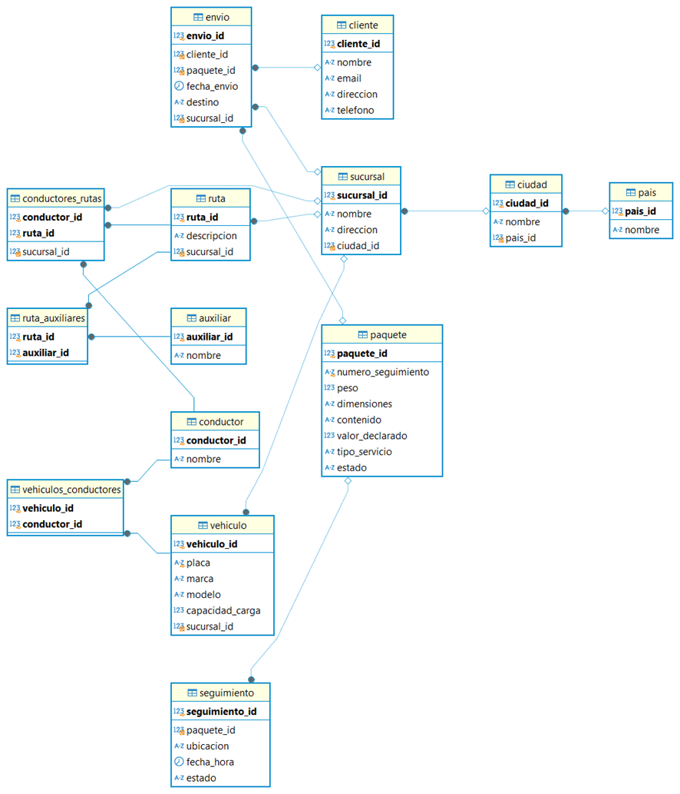

ENTIDADES PRINCIPALES

1.Pais
2.Ciudad
3.Sucursal
4.Cliente
5.Paquete
6.Envio
7.Seguimiento
8.Ruta
9.Conductor
10.Vehiculo
11.Auxiliar

RELACIONES
Pais - Ciudad: Un país tiene muchas ciudades, pero una ciudad pertenece a un solo país.
(1 a N)

Ciudad - Sucursal: Una ciudad tiene muchas sucursales, pero una sucursal pertenece a una sola ciudad.
(1 a N)

Sucursal - Ruta: Una sucursal puede tener muchas rutas, pero cada ruta se origina en una sola sucursal.
(1 a N)

Cliente - Envio: Un cliente puede realizar muchos envíos, pero cada envío pertenece a un solo cliente.
(1 a N)

Paquete - Envio: Un paquete está relacionado con un solo envío, y cada envío corresponde a un solo paquete.
(1 a 1)

Paquete - Seguimiento: Un paquete puede tener muchos registros de seguimiento, pero cada registro de seguimiento pertenece a un solo paquete.
(1 a N)

Ruta - Conductor: Una ruta puede ser asignada a varios conductores en distintos horarios, y un conductor puede recorrer varias rutas.
(N a N)

Conductor - Vehiculo: Un conductor puede conducir varios vehículos (en diferentes momentos), y un vehículo puede ser conducido por varios conductores.
(N a N)

Ruta - Auxiliar: Una ruta puede tener varios auxiliares, y un auxiliar puede estar asignado a varias rutas.
(N a N)

MODELO FISICO 

CREATE TABLE pais (
    pais_id INT PRIMARY KEY AUTO_INCREMENT,
    nombre VARCHAR(100) NOT NULL
);

CREATE TABLE ciudad (
    ciudad_id INT PRIMARY KEY AUTO_INCREMENT,
    nombre VARCHAR(100) NOT NULL,
    pais_id INT,
    FOREIGN KEY (pais_id) REFERENCES pais(pais_id)
);

CREATE TABLE sucursal (
    sucursal_id INT PRIMARY KEY AUTO_INCREMENT,
    nombre VARCHAR(100) NOT NULL,
    direccion VARCHAR(200) NOT NULL,
    ciudad_id INT,
    FOREIGN KEY (ciudad_id) REFERENCES ciudad(ciudad_id)
);

CREATE TABLE cliente (
    cliente_id INT PRIMARY KEY AUTO_INCREMENT,
    nombre VARCHAR(100) NOT NULL,
    email VARCHAR(100) NOT NULL,
    direccion VARCHAR(200) NOT NULL,
    telefono VARCHAR(20) NOT NULL
);

CREATE TABLE paquete (
    paquete_id INT PRIMARY KEY AUTO_INCREMENT,
    numero_seguimiento VARCHAR(50) UNIQUE NOT NULL,
    peso DECIMAL(10, 2) NOT NULL,
    dimensiones VARCHAR(50),
    contenido TEXT,
    valor_declarado DECIMAL(10, 2),
    tipo_servicio VARCHAR(50),
    estado VARCHAR(50)
);
CREATE TABLE envio (
    envio_id INT PRIMARY KEY AUTO_INCREMENT,
    cliente_id INT,
    paquete_id INT,
    fecha_envio TIMESTAMP DEFAULT CURRENT_TIMESTAMP,
    destino VARCHAR(200),
    sucursal_id INT,
    FOREIGN KEY (cliente_id) REFERENCES cliente(cliente_id),
    FOREIGN KEY (paquete_id) REFERENCES paquete(paquete_id),
    FOREIGN KEY (sucursal_id) REFERENCES sucursal(sucursal_id)
);

CREATE TABLE seguimiento (
    seguimiento_id INT PRIMARY KEY AUTO_INCREMENT,
    paquete_id INT,
    ubicacion VARCHAR(200),
    fecha_hora TIMESTAMP DEFAULT CURRENT_TIMESTAMP,
    estado VARCHAR(50),
    FOREIGN KEY (paquete_id) REFERENCES paquete(paquete_id)
);

CREATE TABLE ruta (
    ruta_id INT PRIMARY KEY AUTO_INCREMENT,
    descripcion VARCHAR(200),
    sucursal_id INT,
    FOREIGN KEY (sucursal_id) REFERENCES sucursal(sucursal_id)
);

CREATE TABLE conductor (
    conductor_id INT PRIMARY KEY AUTO_INCREMENT,
    nombre VARCHAR(100) NOT NULL
);

CREATE TABLE auxiliar (
    auxiliar_id INT PRIMARY KEY AUTO_INCREMENT,
    nombre VARCHAR(100) NOT NULL
);

CREATE TABLE conductores_rutas (
    conductor_id INT,
    ruta_id INT,
    sucursal_id INT,
    PRIMARY KEY (conductor_id, ruta_id),
    FOREIGN KEY (conductor_id) REFERENCES conductor(conductor_id),
    FOREIGN KEY (ruta_id) REFERENCES ruta(ruta_id),
    FOREIGN KEY (sucursal_id) REFERENCES sucursal(sucursal_id)
);
CREATE TABLE vehiculo (
    vehiculo_id INT PRIMARY KEY AUTO_INCREMENT,
    placa VARCHAR(20) UNIQUE NOT NULL,
    marca VARCHAR(50),
    modelo VARCHAR(50),
    capacidad_carga DECIMAL(10, 2),
    sucursal_id INT,
    FOREIGN KEY (sucursal_id) REFERENCES sucursal(sucursal_id)
);

CREATE TABLE ruta_auxiliares (
    ruta_id INT,
    auxiliar_id INT,
    PRIMARY KEY (ruta_id, auxiliar_id),
    FOREIGN KEY (ruta_id) REFERENCES ruta(ruta_id),
    FOREIGN KEY (auxiliar_id) REFERENCES auxiliar(auxiliar_id)
);

CREATE TABLE vehiculos_conductores (
    vehiculo_id INT,
    conductor_id INT,
    PRIMARY KEY (vehiculo_id, conductor_id),
    FOREIGN KEY (vehiculo_id) REFERENCES vehiculo(vehiculo_id),
    FOREIGN KEY (conductor_id) REFERENCES conductor(conductor_id)
);

